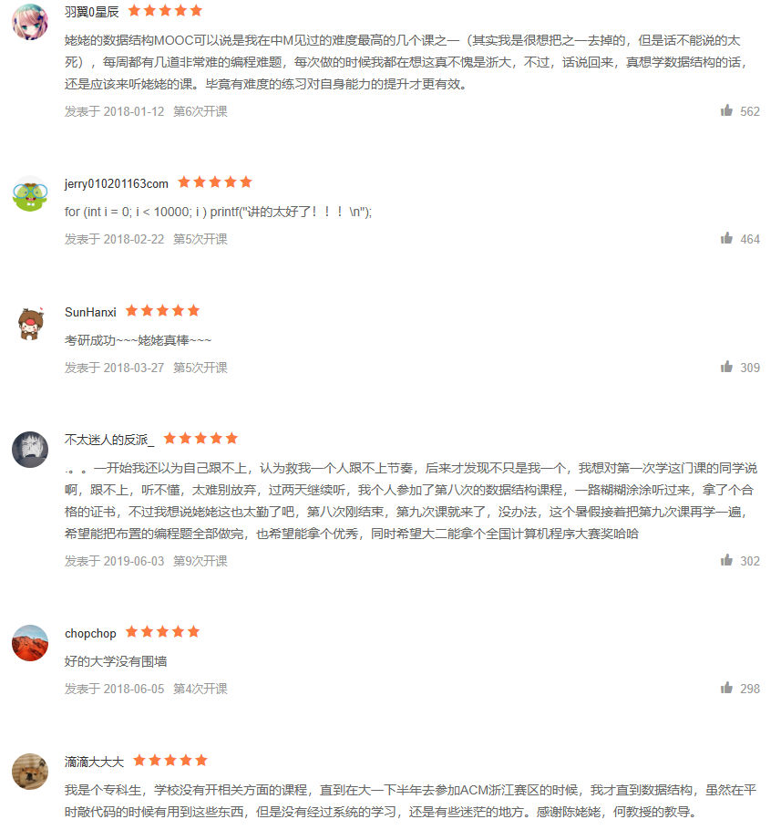
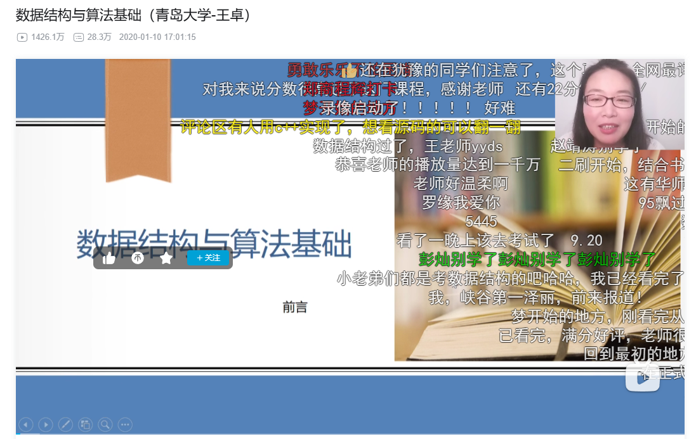
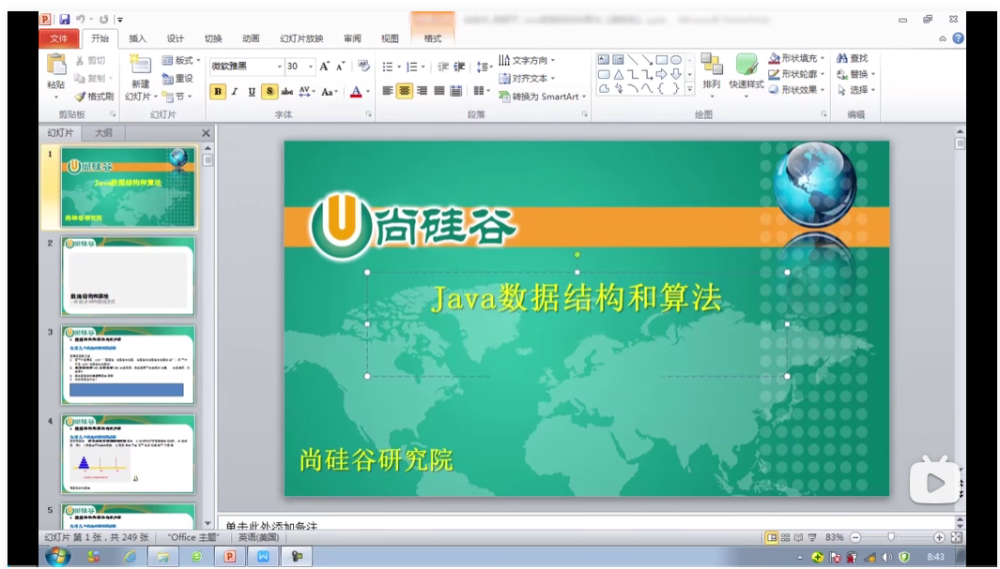
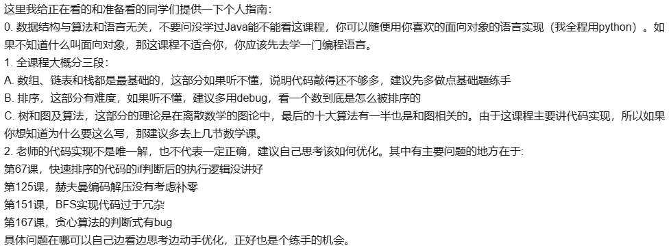

- # 推荐课程资源
    - ## [浙江大学-数据结构（中国大学MOOC）](https://www.icourse163.org/course/ZJU-93001?tid=1473284469)
    
    
    - ## [数据结构-青岛大学王卓（b站）](https://www.bilibili.com/video/BV1nJ411V7bd?vd_source=2bc5b07cfff33b78ea45e41154ac600a)
    
    - ## [尚硅谷数据结构java版--（b站）](https://www.bilibili.com/video/BV1E4411H73v?vd_source=2bc5b07cfff33b78ea45e41154ac600a)
    
    
- # 推荐书籍
    - ## [大话数据结构](https://item.jd.com/12987622.html)
    
    - ## [算法图解](https://item.jd.com/14799704.html)
    